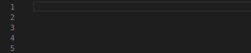
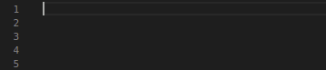
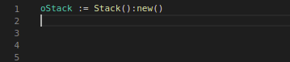
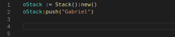
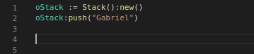
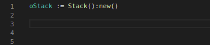

# tlpp-stack
Classe de pilha. Desenvolvida na linguagem TL++ (Linguagem proprietária da TOTVS) 
  

1. [Definição](#Definição)
1. [Metodos](#Metodos)
1. [Extras](#Extras)
  

## Definição
A classe 'Stack' foi desenvolvida com intuito de possibilitar a vida dos desenvolvedores que desejam fazer uso da estrutuda de dados pilha na linguagem TL++. A implementação possibilita a utilização da classe de forma genérica, ou seja, sem definir um tipo de dado para os elementos, permitindo assim que cada elemento seja de um tipo diferente. Entre tando também é possivel definir um tipo no momento de instanciar, se isso for feito, todos os elementos da pilha devem ser do tipo definido.
  

## Metodos
- new
- push
- pop
- getTop
- size
- isEmpty
  

### new( [type] )

Método responsável por instanciar a classe, o parametro 'type' é do tipo caracter e opcional. Caso seja informado estaremos definindo um tipo para a pilha, que deve ser uma das opções abaixo:

- "A" (Array)
- "B" (CodeBlock)
- "C" (Character)
- "D" (Date)
- "L" (Logical)
- "N" (Numeric)
- "O" (Object)
  

### Exemplo genérico

 

### Exemplo tipagem forte

### push( element )
Método para empilhar elementos na pilha, se a pilha tiver um tipo definido, será executado uma verificação de tipagem no parametro 'element' informado. Parâmetro 'element' é obrigatório.
  

  

### pop()
Método desempilha um elemento da pilha e retorna o mesmo.
  

  

### getTop()
Retorna o topo da pilha, sem desempilhar.
  

  

### size()
Método informa a quantidade de elementos na pilha.
  

  

### isEmpty()
Método retorna um boleano informando se a pilha está ou não vazia.
  

  

## Extras
Veja na pasta ['examples'](https://github.com/gabrielhklok/tlpp-stack/tree/master/examples) alguns exemplos de fontes usando a classe 'Stack'.